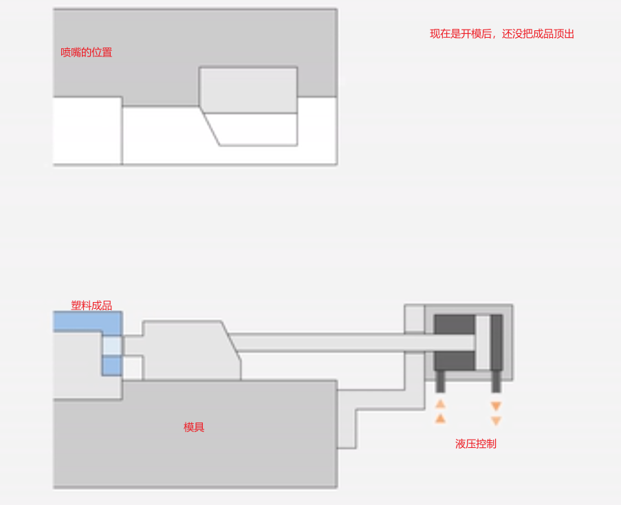

# 按系统分类
## 注射系统
核心作用：负责塑料的塑化（熔融）和注射（将熔料推入模具）。 

包含部件：料斗、螺杆、料筒（加热圈）、注射油缸、射嘴。
## 合模系统
核心作用：负责模具的开启、闭合以及锁紧（提供足够大的锁模力，防止注射时模具被胀开）。  

包含部件：头板、二板、尾板、拉杆（哥林柱）、合模油缸（或曲肘机构）、顶出装置。
## 液压系统
核心作用：提供动力（将电能转化为液压能），驱动各个油缸执行动作。

包含部件：液压油箱、油泵（伺服泵/变量泵）、液压油、各种电磁阀（方向阀、压力阀）、油管、冷却器
## 电控系统
核心作用：机器的大脑和神经网络，负责程序控制、逻辑判断、信号处理和参数设定。

包含部件：电脑控制器（主板/CPU）、IO板（就是你问的中子控制电路板）、显示屏、各种传感器（温度、位置、压力传感器）、继电器、电磁阀线圈。
## 润滑系统
核心作用：对机器的运动部件（如曲肘关节、滑脚、导轨等）进行自动定时供油，减少摩擦和磨损，延长机器寿命。

包含部件：润滑泵、分配器（分油块）、油管、油嘴。
## 安全防护系统
包括安全门、液压安全阀、紧急停止按钮等。

# 按部位分类
## 中子部分
在注塑行业中，我们常说的“中子”（Core Pulling，也叫抽芯）是指在模具开合过程中，为了成型带有侧孔、凹槽或内螺纹的复杂制品，需要从模具中抽拔出来的活动型芯。他的动作主要是两个：抽芯和插芯。  
抽芯是指在模具开合过程中，模具打开后，抽芯机构将核心部件从模具中抽出，使得制品能够顺利脱模。插芯则是在模具闭合过程中，将核心部件插入模具中，以形成制品的内部结构。他的控制由注塑机的控制单元来实现，而执行一般由液压系统来完成。

# 1 注塑系统
## 1.1 炮筒温度设定
温度需要提前升温，不然调不了机，每一个材料都有自己的理论温度，不能超过这个温度，否则会损坏材料。
注意事项：
1. 不同的材料由不同的理论值，还有加热时间等
2. 下料口处接有冷却水

### 1.1.1 下料口温度设定
1. 结晶性塑料 (如 PA、POM、PBT):
- 有明确的熔点 (Tm)
- 下料口温度通常设定在 Tm - 10~20℃ 或更低
- 目的是让物料保持固态颗粒状态
2. 非结晶性塑料 (如 PS、ABS、PC):
- 没有明确熔点，只有玻璃化转变温度 (Tg)
- 下料口温度通常设定在 室温~80℃ 之间
- 主要防止吸湿物料结块
3. 实际工程中的设定原则
- 普通物料，常温或略高于室温，防止颗粒粘连
- 易吸湿物料 (PA、PET)，80-120℃，防止水分导致结块
- 热敏性物料，较低温度，防止过早分解

## 1.2 注塑机调机
注塑机调机是指在注塑过程中，根据不同的材料和产品需求，调整注塑机的参数，以获得最佳的成型效果。前提准备是要先热机，原则是热模具，后调机，因为设备会热胀冷缩，如果不是在热的环境下，调机后会出现一些问题，比如模具开合不正常，注射不均匀等。  
首先第一步是开模关模调顶针，确保顶针的动作正常，要不东西都压好了，却顶不出来，就很麻烦。接着确定

## 杂七杂八
1. 系统显示的压力就是合模力
2. 新产品一般不超过10公斤合模力（MPa）
3. 开模位置的第二段慢速高压，一般位置设置30，压力为70
4. 开模第三段一般为中板刚好分离的位置 点，压力设为50

